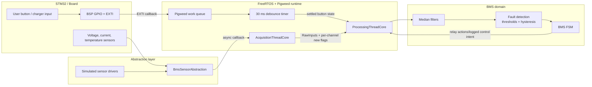
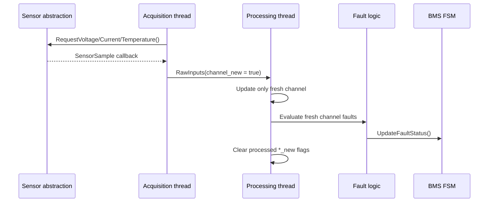
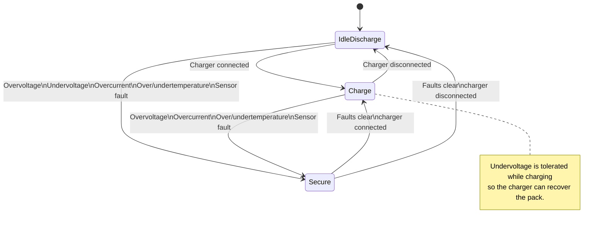
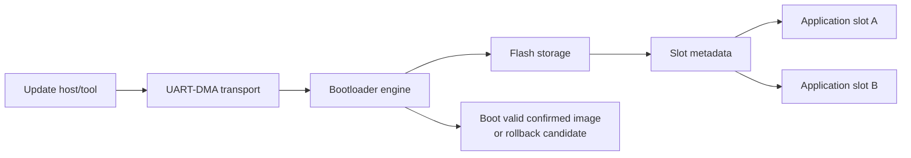

# bms_firmware

[](https://bazel.build)


`bms_firmware` is a portfolio embedded firmware project that implements a
Battery Management System control stack on STM32 using modern C++, FreeRTOS,
Pigweed, Bazel, and Google Test.

The project focuses on the kind of firmware architecture used in safety-oriented
embedded products: separated acquisition and processing threads, deterministic
message passing, integer-only filtering, explicit fault handling, and a finite
state machine that controls charge, discharge, and secure behavior.

## What It Demonstrates

- Real-time firmware architecture with FreeRTOS threads and Pigweed primitives
- Clean separation between BSP, drivers, domain logic, and thread orchestration
- Asynchronous, non-blocking sensor acquisition for voltage, current, and temperature
- Hardware abstraction layer that hides sensor implementation details from BMS logic
- BMS safety logic with filtering, hysteresis, freshness tracking, and fault latching
- FSM-based control for `IdleDischarge`, `Charge`, and `Secure`
- Button interrupt handling with work-queue deferral and debounce
- Pigweed modules for logging, synchronization, timers, work queues, threads, and tests
- Dual-slot bootloader foundation with metadata, CRC, transport, storage, and rollback tests
- Git-friendly workflow with deterministic Bazel builds, unit tests, and format checks
- Host-side unit tests for drivers, acquisition, processing, FSM, and bootloader logic

## System Architecture



## Runtime Data Flow

The acquisition layer uses an asynchronous callback model. The acquisition
thread requests sensor reads through `BmsSensorAbstraction`, and sensor results
come back as `SensorSample` callbacks. This keeps the acquisition thread from
blocking on individual sensor operations and keeps hardware-specific details out
of the BMS domain logic.

The acquisition thread publishes each sensor update immediately. Each raw
message marks only the channel that changed with a `*_new` flag. The processing
thread keeps the latest processed values, updates only fresh channels, runs the
safety checks for those fresh channels, and clears the processed `*_new` flags
after the safety decision is made.

This avoids a common startup bug: a voltage-only first sample should not make
current and temperature look failed just because their first samples have not
arrived yet. At the same time, a fresh invalid sample still raises a sensor
fault and drives the FSM into `Secure`.



## BMS State Machine



## Safety Logic

- Voltage protection:
  - Overvoltage trips above the configured limit and clears below recovery.
  - Undervoltage trips below the configured limit and clears above recovery.
  - Undervoltage is protective in `IdleDischarge`, but tolerated in `Charge`.
- Current protection:
  - Uses absolute current.
  - Accumulates stress over time for low, medium, and high overcurrent regions.
  - Trips immediately at cutoff current.
  - Requires recovery current and recovery delay before clearing.
- Temperature protection:
  - Overtemperature and undertemperature use independent trip and recovery thresholds.
- Sensor faults:
  - Evaluated only when a fresh channel sample arrives.
  - A fresh invalid channel latches sensor fault behavior through the FSM.
- Button debounce:
  - EXTI is kept short and defers work to the Pigweed work queue.
  - A 30 ms timer reads the settled button state and maps it to charger connected
    or disconnected.

## Bootloader

The project includes a dual-slot bootloader foundation intended to demonstrate
firmware update design beyond the main application loop.

Implemented bootloader pieces:

- A/B image metadata model with active, pending, and confirmed image state
- CRC32 validation for image integrity checks
- Boot decision engine for selecting a valid image and supporting rollback
- Flash storage abstraction for metadata and image state
- UART-DMA transport layer for update communication
- Host-side tests for CRC, metadata handling, boot decisions, flash storage, and transport behavior



## Pigweed Usage

Pigweed is used as a practical embedded support layer rather than only as a
build dependency:

- `pw_log` for structured runtime logging
- `pw_sync::Mutex` and `pw_sync::ThreadNotification` for safe thread coordination
- `pw_chrono::SystemTimer` for periodic sampling and button debounce
- `pw_thread::ThreadCore` and FreeRTOS thread options for task structure
- `pw_system::WorkQueue` for ISR deferral
- `pw_unit_test` for host-side Google Test integration

## Repository Structure

```text
apps/src/application/
  abstraction/       Sensor abstraction layer
  domain/            BMS parameters, fault status, processed/raw inputs, FSM
  drivers/           Simulated sensors with fault injection
  filters/           Median filter implementation
  threads/           Acquisition and processing thread cores
  test/              Host unit tests

apps/src/bsp/        STM32 GPIO, LEDs, button EXTI
apps/src/bootloader/ Dual-slot bootloader implementation
targets/stm32l4xx/   STM32 platform, linker scripts, HAL/FreeRTOS config
tools/               Utility targets
```

## Testing And Quality Workflow

Host unit tests cover:

- Sensor simulation and fault modes
- Sensor abstraction
- Acquisition queueing and raw freshness flags
- Processing filters, thresholds, hysteresis, current stress, and FSM integration
- BMS FSM transitions
- Bootloader CRC, metadata, engine, storage, and UART-DMA transport

Run the host test suite:

```bash
bazel test \
  //apps:sim_sensor_test \
  //apps:sensor_abstraction_test \
  //apps:acquisition_thread_test \
  //apps:processing_thread_test \
  //apps:bms_fsm_test \
  //apps:bld_crc32_test \
  //apps:bld_engine_test \
  //apps:bld_meta_test \
  //apps:bld_storage_flash_test \
  //apps:bld_transport_uart_dma_test
```

Run the format check:

```bash
bazel run //tools:format -- check
```

Apply formatting:

```bash
bazel run //tools:format -- format
```

Suggested Git workflow before opening a pull request or sharing the project:

```bash
git status --short
bazel run //tools:format -- check
bazel test \
  //apps:sim_sensor_test \
  //apps:sensor_abstraction_test \
  //apps:acquisition_thread_test \
  //apps:processing_thread_test \
  //apps:bms_fsm_test \
  //apps:bld_crc32_test \
  //apps:bld_engine_test \
  //apps:bld_meta_test \
  //apps:bld_storage_flash_test \
  //apps:bld_transport_uart_dma_test
bazel build //apps:application.elf --platforms=//targets/stm32l4xx:application_platform
git diff --check
```

## Build

Build the STM32 application image:

```bash
bazel build //apps:application.elf --platforms=//targets/stm32l4xx:application_platform
```

Build A/B application slot images:

```bash
bazel build //apps:application_slot_a.elf --platforms=//targets/stm32l4xx:application_platform
bazel build //apps:application_slot_b.elf --platforms=//targets/stm32l4xx:application_platform
```

## Engineering Notes

- The runtime avoids floating point in the signal-processing path.
- ISRs do minimal work and defer processing to thread or work-queue context.
- Sensor reads are requested asynchronously and delivered through callbacks.
- Hardware-facing details are hidden behind an abstraction layer so the domain
  code can be tested on the host.
- Shared state is protected with Pigweed mutexes.
- Queue overflow policy drops the oldest raw input to keep the newest safety data.
- FSM transitions are explicit and unit-tested.
- The bootloader and threading structure build on reusable embedded architecture
  ideas from my earlier `pigweed_play` work, while the BMS domain logic, safety
  model, FSM, and tests are implemented here.
